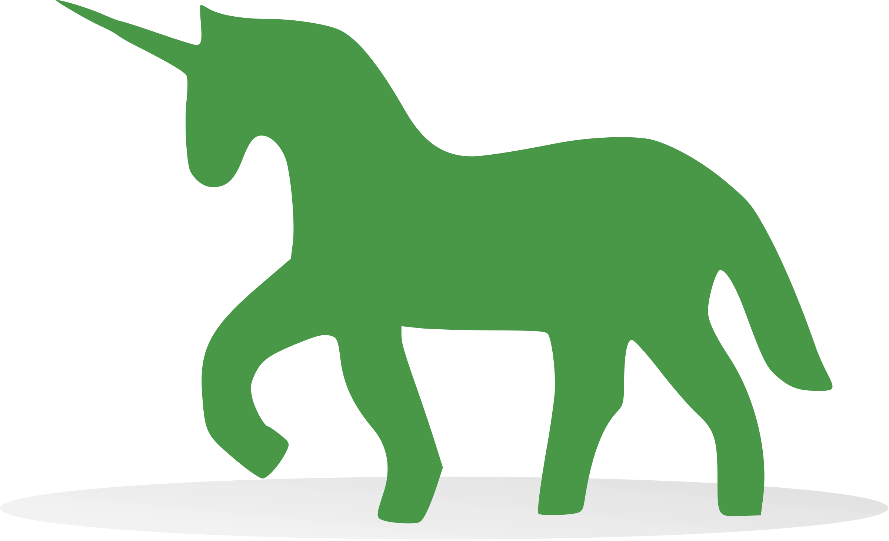

[](https://classroom.github.com/a/yKzEOXws)
[](https://classroom.github.com/open-in-codespaces?assignment_repo_id=22655376)
# Serving Machine Learning Models through RESTish APIs using Flask in Python

| Key              | Value                                                                                                                                                                                                                                                                                     |
|:-----------------|:------------------------------------------------------------------------------------------------------------------------------------------------------------------------------------------------------------------------------------------------------------------------------------------|
| **Course Code** | BBT 4206                                                                                                                                                                                                                                                                                  |
| **Course Name** | BBT 4206: Business Intelligence II (Week 4-6 of 13)                                                                                                                                                                                                                                       |
| **Semester**     | January to April 2026                                                                                                                                                                                                                                                                   |
| **Lecturer**     | Allan Omondi                                                                                                                                                                                                                                                                              |
| **Contact**      | aomondi@strathmore.edu                                                                                                                                                                                                                                                                    |
| **Note**         | The lecture contains both theory and practice.<br/>This notebook forms part of the practice.<br/>It is intended for educational purposes only.<br/>Recommended citation: [BibTex](https://raw.githubusercontent.com/course-files/ServingMLModels/refs/heads/main/RecommendedCitation.bib) |

## Technology Stack

<p align="left">





</p>

## Repository Structure

```text
.
├── LICENSE
├── Procfile
├── README.md
├── RecommendedCitation.bib
├── admin_instructions
│   ├── instructions_for_postlab_cleanup.md
│   ├── instructions_for_project_setup.md
│   └── instructions_for_python_installation.md
├── api.py
├── app_server_reverse_proxy_server_setup.md
├── assets
│   └── images
│       ├── Hf-logo-with-title.svg
│       ├── Render-logo-Black.png
│       ├── Streamlit-logo-primary-colormark-darktext.png
│       └── ssh_student_at_localhost_p_2222.jpeg
├── cleanup_instructions.md
├── container-volumes
│   ├── nginx
│   │   └── nginx.conf
│   └── ubuntu
├── docker-compose-dev.yaml
├── docker-compose-prod.yaml
├── docker-compose.yaml
├── dockerfiles
│   ├── Dockerfile.flask-gunicorn-app
│   ├── Dockerfile.nginx
│   └── ubuntu
│       ├── Dockerfile.ubuntu
│       └── entrypoint.sh
├── env.example
├── frontend
│   ├── Proxies.png
│   ├── RequestFlow.jpg
│   ├── RequestFlow.png
│   ├── api_consumer.py
│   ├── api_consumer_from_dev_flask.py
│   ├── api_test_DT_classifier.html
│   ├── api_test_DT_regressor.html
│   └── index.html
├── huggingface-spaces-using-gradio
│   ├── app.py
│   └── requirements.txt
├── lab_submission_instructions.md
├── model
│   ├── decisiontree_classifier_baseline.pkl
│   ├── decisiontree_regressor_optimum.pkl
│   ├── knn_classifier_optimum.pkl
│   ├── label_encoders_1b.pkl
│   ├── label_encoders_2.pkl
│   ├── label_encoders_4.pkl
│   ├── label_encoders_5.pkl
│   ├── naive_Bayes_classifier_optimum.pkl
│   ├── onehot_encoder_3.pkl
│   ├── random_forest_classifier_optimum.pkl
│   ├── scaler_4.pkl
│   ├── scaler_5.pkl
│   └── support_vector_classifier_optimum.pkl
├── publicly_serving_the_model_for_validation_by_domain_experts.md
├── requirements
│   ├── base.txt
│   ├── colab.txt
│   ├── constraints.txt
│   ├── dev.inferred.txt
│   ├── dev.lock.txt
│   ├── dev.txt
│   └── prod.txt
├── rules
├── runtime.txt
└── streamlit-sharing-using-streamlit
    ├── app.py
    └── requirements.txt

15 directories, 58 files
```

## Setup Instructions

- [Setup Instructions](./admin_instructions/instructions_for_project_setup.md)

## Lab Manual

Refer to the files below, in the order specified, for more details:

1. [api_consumer.py](frontend/api_consumer.py)
2. [api.py](api.py)
3. [api_consumer_from_dev_flask.py](frontend/api_consumer_from_dev_flask.py)
4. [api_test_DT_classifier.html](frontend/api_test_DT_classifier.html)
5. [api_test_DT_regressor.html](frontend/api_test_DT_regressor.html)
6. [Reverse Proxy Server and Application Server Setup](app_server_reverse_proxy_server_setup.md)
7. [Publicly Serving the Model for Validation by Domain Experts](publicly_serving_the_model_for_validation_by_domain_experts.md)

## Lab Submission Instructions

- [Lab Submission Instructions](lab_submission_instructions.md)

## Cleanup Instructions (to be done after submitting the lab)

- [Cleanup Instructions](/admin_instructions/instructions_for_postlab_cleanup.md)
